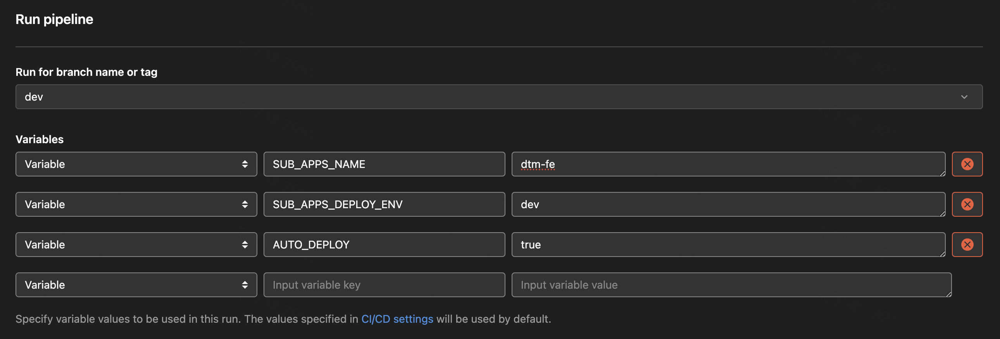

## DTM 成交单管理系统 ✨

<p align="left">
    <a href="https://reactjs.org/">
      
    </a>
    <a href="https://www.typescriptlang.org/">
      
    </a>
    <a href="https://pnpm.io/zh/">
      
    </a>
</p>

### 🎈&nbsp; **_Instructions_**

- 🛠️&nbsp; 本项目为 **_DTM_** **成交单管理系统**（下简称为 **_DTM_**），作为 **_OMS_** **_monorepo_** 项目的一个子项目，部分公共依赖库声明在 **_OMS_** 根目录中的 **_package.json_** 中
- 💡&nbsp; 使用 **_pnpm_** 作为 **_monorepo_** 的管理工具

### 📖&nbsp; **_Design_**

- [**设计稿**](https://www.figma.com/file/yJCqKUmieesCUqPeB9XXWP/OMS?type=design&node-id=8775%3A246975&mode=design&t=DphaQ6lC3PmWzkHz-1)

### 🚀&nbsp; **_Technology stacks_**

- [**_React 18_**](https://reactjs.org/) + [**_pnpm 7_**](https://pnpm.io/)
- [**_TypeScript 5.x_**](https://www.typescriptlang.org/)

### 🗃&nbsp; **_Project structure_**

本项目虽为 **_monorepo_** 项目的一个子项目，但其可视作一个完全独立的项目，无需过多关心 **_monorepo_** 的内容。

项目结构与普通项目结构类似，更多内容可在项目路由（**_dtm-fe/src/router_**) 中了解。

### 🤔&nbsp; **_How to use?_**

1. 在 **_OMS_** 项目中任意位置使用一下命令安装依赖库：

   ```bash
   pnpm i
   ```

2. **_cd_** 到 **_DTM_** 项目根目录中，即可运行 **_DTM_** 项目 **_package.json_** 内的命令：

   ```bash
   cd apps/dtm-fe/
   ```

   或在 **_OMS_** 项目根目录中，运行以下命令运行部分 **_DTM_** 项目的命令（只是一种方便在不切换当前所在文件位置的快捷操作）：

   ```json
    "dtm-dev": "pnpm run -C apps/dtm-fe dev",
    "dtm-dev:test": "pnpm run -C apps/dtm-fe dev:test",
    "dtm-build": "pnpm run -C apps/dtm-fe build",
    "dtm-preview": "pnpm run -C apps/dtm-fe preview",
    "dtm-lint": "pnpm run -C apps/dtm-fe lint",
    "dtm-lint:fix": "pnpm run -C apps/dtm-fe lint:fix"
   ```

3. 使用 **_DTM Vite_** 本地开发相关命令时，可在后续使用 **_--mode_** 修改接入的服务端环境（不使用则默认为接入服务端 **_dev_** 环境），如：

   ```bash
   pnpm dev --mode test
   ```

   则会在本地开发时，接入服务端 **_test_** 环境，并且，此时代码能读取相关 **_mode_** 并存储在 **_Vite_** 的全局变量 **\_\_API_ENV\_\_** 中，从而在项目中根据 **\_\_API_ENV\_\_** 执行相关代码。

### 👀&nbsp; **_How to install the package in project?_**

- 如果为 **_DTM_** 项目独有依赖库，需在 **_DTM_** 项目根目录中新增所需依赖库，如：

  ```bash
  cd apps/dtm-fe/

  pnpm add react-to-print
  ```

- 如果为 **_OMS_** 项目独有依赖库或公共依赖库，需在 **_OMS_** 项目根目录新增所需依赖库，如：

  ```bash
  pnpm add -w @fepkg/icon-park-react
  ```

### 👷&nbsp; **_CI_**

本项目的 **_CI_** 已能够正常运转，如无特殊情况请勿更改相关配置！因本项目与 **_OMS_** 项目同在一个 **_Gitlab_** 仓库中，因此本项目 **_CI_** 实际跑的是 **_OMS_** [**_Gitlab CI_**](https://git.zoople.cn/shihe/project_group/bdm/bds/bds-fe/-/pipelines)。

#### 使用步骤

- 点击 **_OMS Gitlab CI_** 的 **_Run pipeline_** 按钮

  

- 然后输入对应的环境变量后，继续点击 **_Run pipeline_** 按钮即可完成对应环境的构建与部署

  

#### 环境变量释义

| 变量名称                | 介绍                                                                                        | 是否必填 | 可选值                                                    | 默认值 |
| ----------------------- | ------------------------------------------------------------------------------------------- | -------- | --------------------------------------------------------- | ------ |
| **SUB_APPS_NAME**       | 声明本次 **_CI_** 对什么子项目进行构建部署，此时不会执行 **_OMS_** 项目的相关 **_CI_** 命令 | 是       | `dtm-fe` &#124; `odm-fe`                                  |        |
| **SUB_APPS_DEPLOY_ENV** | 本次 **_CI_** 构建后自动部署的环境                                                          | 是       | `dev` &#124; `test` &#124; `xintang` &#124; `xintang-uat` |        |
| **AUTO_DEPLOY**         | 本次 **_CI_** 是否自动部署                                                                  | 否       | `true` &#124; `false`                                     | `true` |

若 **SUB_APPS_DEPLOY_ENV** 为 `xintang` 或 `xintang-uat`，则不会自动部署，需要 **_SRE_** 手动支持部署，但会打出一个对应的渠道包。

指定 **SUB_APPS_DEPLOY_ENV** 在前端项目中的本质为在执行 **_Vite_** 构建命令时指定 **_--mode_**，如：

```bash
pnpm build --mode test
```
